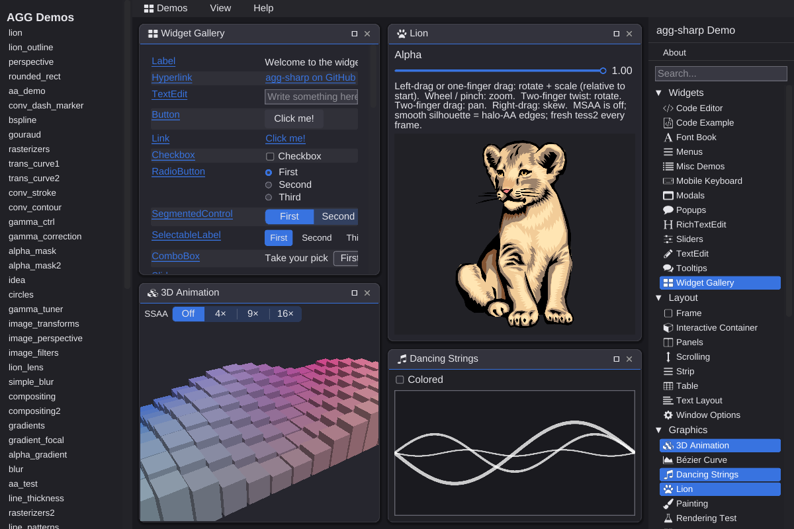
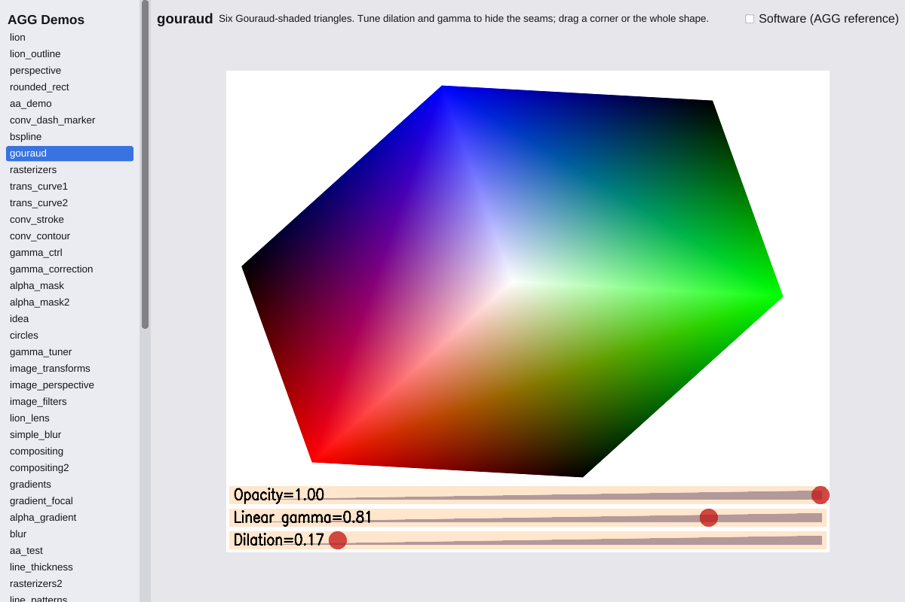

# agg-sharp

`agg-sharp` is a C# port of [Anti-Grain Geometry (AGG)](https://agg.sourceforge.net/antigrain.com/)
grown into a full application framework: a widget toolkit, a WebGPU renderer, polygon meshes, CSG,
vector math, SVG and more. It runs on Windows, macOS, Linux and in the browser (wasm), and it is the
foundation MatterCAD is built on.

[](https://github.com/larsbrubaker/agg-sharp/actions/workflows/tests.yml)
[](https://larsbrubaker.github.io/agg-sharp/)

## Support the Project

<a href="https://buymeacoffee.com/larsbrubaker"></a>

agg-sharp is open-source and free to use, maintained in spare time as a labor of love.

If you find it useful, here are a few ways to help keep development going:

- **Donations:** [Buy Me a Coffee](https://buymeacoffee.com/larsbrubaker) — every coffee helps.
- **Star the repo:** Costs nothing and helps others find the project.
- **Report issues:** [Open an issue](https://github.com/larsbrubaker/agg-sharp/issues) for bugs or feature ideas.
- **Contribute:** [PRs welcome](https://github.com/larsbrubaker/agg-sharp/pulls) — open an issue first to discuss larger changes.

## Live Demo

> **[Open the live demo →](https://larsbrubaker.github.io/agg-sharp/)**

[](https://larsbrubaker.github.io/agg-sharp/)

The demo is one C# app, the same code the native mac head runs, compiled to wasm and drawn with
WebGPU. Every pixel is agg-sharp's; there is no HTML chrome. Two tabs across the top switch between
its two sections. Both have the same layout: a menu bar, the content on the left, and the list to pick
from on the right. In a narrow window (a phone) that list folds away behind a button, and you pick
from the Demos menu instead.

- **AGG Demos** — 62 of agg-rust's ports of the classic AGG examples (lion, gouraud, perspective,
  alpha_gradient, image_filters, ...), including their in-canvas controls, grouped by what they show and
  listed alphabetically. Each one is drawn on the GPU, and its software render is byte-identical to
  C++ AGG 2.4; a per-demo toggle shows that software reference for comparison.
- **agg-sharp Demos** — parity with [agg-gui](https://github.com/larsbrubaker/agg-gui)'s demo app:
  floating, snapping windows, menus, themes, and windows for widgets, layout, graphics, interaction and
  tests.

The site remembers the open tab, the AGG demo, and the agg-sharp windows and settings across visits.

Any demo can be linked directly by name, for example
[#gouraud](https://larsbrubaker.github.io/agg-sharp/#gouraud) or
[#GUI Demo](https://larsbrubaker.github.io/agg-sharp/#GUI%20Demo).

[](https://larsbrubaker.github.io/agg-sharp/#gouraud)

## What's Inside

- **2D graphics (AGG)** — anti-aliased scanline rasterizer with subpixel accuracy, strokes, dashes,
  gradients, image filters and transforms, gamma control, alpha masks, compositing, fonts and text.
- **GUI toolkit** — widgets (buttons, text editing, menus, tree and list views, color picker, code
  editor, ...), flow and flex layout, theming, an inspector, and a GUI automation framework for UI tests.
- **WebGPU renderer** — one render backend, wgpu-native with WGSL shaders: D3D12 on Windows, Metal on
  macOS, Vulkan on Linux, and the browser's own WebGPU in wasm. 2D drawing goes through the same
  `Graphics2D` API on the GPU as in software.
- **3D and geometry** — polygon meshes with BVH acceleration, CSG booleans, vector math (vectors,
  matrices, quaternions, bounding boxes), tessellation, polygon clipping, and STL/AMF/OBJ/3MF loaders.
- **SVG** — parsing and rendering, including gradients, patterns, markers, clip masks and filters.
- **Image processing** — filters, transforms and analysis.

## Getting Started

**Prerequisites:** the [.NET 10 SDK](https://dotnet.microsoft.com/download). Clone with submodules:

```sh
git clone --recursive https://github.com/larsbrubaker/agg-sharp.git
```

### Build and run the tests

```sh
cd Tests/Agg.Tests
dotnet build
dotnet bin/Debug/Agg.Tests.dll
```

Tests use [TUnit](https://tunit.dev/). Run one class with
`dotnet bin/Debug/Agg.Tests.dll --treenode-filter "/*/*/<TestClass>/*"`.

### Run the demo app natively (macOS)

```sh
dotnet run --project examples/AggSharpDemo/AggSharpDemo.Mac
```

`AGG_DEMO=gouraud` (or `"GUI Demo"`) opens it on a given demo.

### Publish the demo site

```sh
dotnet workload install wasm-tools     # once
scripts/publish-demo-site.sh           # prints the folder to serve
scripts/check-demo-site.py --out /tmp/site.png   # serves it, loads it in headless Chrome, screenshots it
```

This is the same script the [Demo site workflow](.github/workflows/pages.yml) runs to deploy GitHub Pages.
The first build seeds an Emscripten cache of about 215 MB.

## Platforms

| Platform | Host | GPU API |
|----------|------|---------|
| Windows | WinForms (`PlatformWin32`) | D3D12 |
| macOS | AppKit (`PlatformMac`) | Metal |
| Linux | X11 (`PlatformLinux`) | Vulkan |
| Browser | wasm + Blazor loader (`PlatformBrowser`) | WebGPU |

## Project Layout

| Folder | Description |
|--------|-------------|
| `agg/` | Core 2D graphics: `Graphics2D`, image buffers, rasterizer, fonts, SVG |
| `Gui/` | Widget toolkit: widgets, layout, theming, windowing |
| `GuiAutomation/` | Automated UI testing framework |
| `RenderCore/` | Backend-agnostic render seam: `IRenderDevice`, encoders, resources |
| `RenderGl/` | GPU drawing layer: `Graphics2DGpu`, the `GL` facade, scene renderers |
| `WebGpu/`, `WebGpuRender/` | `webgpu.h` bindings and the wgpu-native render backend with its WGSL shaders |
| `Platform*/` | Window, input and clipboard hosts for Windows, macOS, Linux and the browser |
| `PolygonMesh/`, `Csg/`, `VectorMath/` | 3D meshes, CSG booleans and math primitives |
| `DataConverters2D/`, `DataConverters3D/` | 2D path conversion and 3D file format loaders |
| `ImageProcessing/` | Image filters, transforms and analysis |
| `examples/AggSharpDemo/` | The demo app: shared library plus `.Mac` and `.Browser` heads |
| `tools/cpp-renderer/` | Headless C++ AGG renderer that produces the byte-exact reference images |
| `Tests/Agg.Tests/` | The test suite |

## Related Projects

- [agg-rust](https://github.com/larsbrubaker/agg-rust) — AGG in Rust. The AGG demos here are ports of
  its demos, checked against the same C++ AGG 2.4 renders.
- [agg-gui](https://github.com/larsbrubaker/agg-gui) — a Rust GUI library on agg-rust; the GUI Demo
  matches its demo app.
- **MatterCAD** — the CAD application built on agg-sharp,
  which consumes it as a submodule.

## Credits

AGG was created by Maxim Shemanarev. agg-sharp began as a C# translation of his
AGG 2.4 and keeps its ideas: anti-aliasing, subpixel accuracy, and the highest possible quality.

## License

BSD 2-clause. See [LICENSE](LICENSE).

Third-party assets:

- `Gui/Fonts/fa-solid-900.ttf` — [Font Awesome Free](https://fontawesome.com) 6.7.2 Solid by Fonticons, Inc.,
  agg's built-in icon font (`MatterHackers.Agg.UI.IconFont`). The font is SIL OFL 1.1 and the icons are
  CC BY 4.0; see [Gui/Fonts/fa-solid-900-LICENSE.txt](Gui/Fonts/fa-solid-900-LICENSE.txt).
